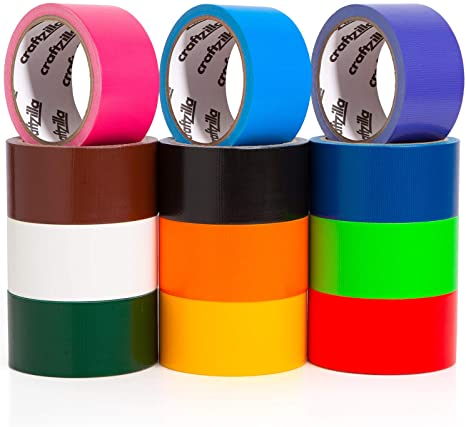
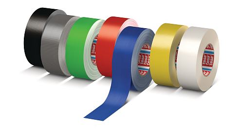
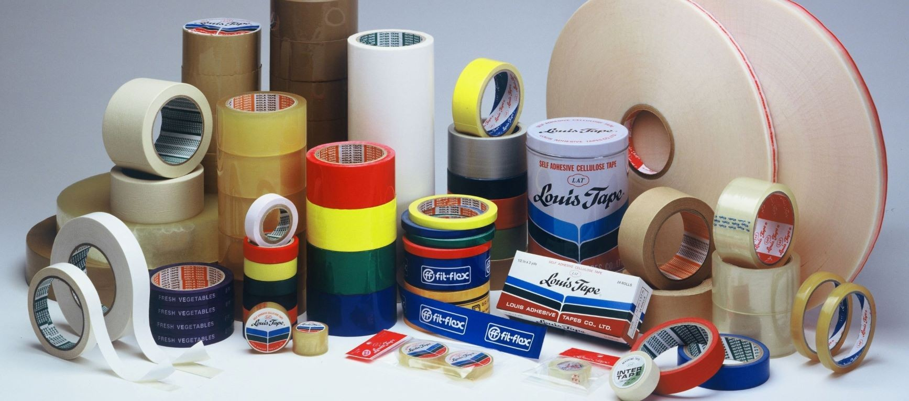

# The difference is not only in color: what differences are hidden in the tapes

Every experienced owner and master knows that the most correct duct tape - this blue. Without it, there will be no reliable insulation, no strong connection. The strength is not even true, the strength is in the blue duct tape! However, if you put the jokes aside, it should be noted at once: not all the duct tape on the market is the same, despite the external similarity. So, let's try to understand this question.

## The duct tape can be very different.

All the duct tape can be divided into two main criteria. The first, quite obvious, is the manufacturer. By the way, not many people pay attention to it, but for nothing. The second, less obvious, is the material from which the insulation tape is created. If with the companies-manufacturers, everything is more or less clear: someone is doing better, someone is doing worse, then the fact that most people do not even guess about the fact that they use different raw materials to create the tape. Today, the tape can be made of CB or PVC. Let's talk about each of them.

## Duct tape - very useful in the farm.

Cotton insulation tape is well known to domestic masters since the Soviet Union. However, you do not need to think that they did and are doing this only in our country. This material is well known throughout the world. The main advantage of XB tape is its high durability. It perfectly tolerates temperature fluctuations, high and low temperatures, including frost. It is very difficult to tear or wipe. However, there are also disadvantages of the CB ribbon. The main thing is that it most often can not withstand voltage greater than 1 kV. In addition, this tape has a very poor moisture resistance.

Use XB tape is mainly when performing any work inside a closed room. It can be safely used in the house or apartment, but not in places where moisture can appear.

## It's not just about the colors.

Polyvinylchloride insulation tape appeared later than her cotton relative. In fact, it is the exact opposite of XB tape. This material has an exceptional resistance to moisture and damp, and can withstand operating voltage up to 5 kV. All this makes it an almost ideal insulating material. However, there are also disadvantages. The first is poor resistance to elevated temperatures. Already when heated to 80 degrees Celsius PVC strip begins to melt. At low temperatures, it also quickly spoils, crumbles. All this makes it unacceptable to work on the street.

PVC tape can be used in most cases, if there is no threat of extreme effects. In the latter case, you will have to supplement the twisting with a layer of CB tape or provide insulation in some other, additional ways.

Only blue is hardcore.

